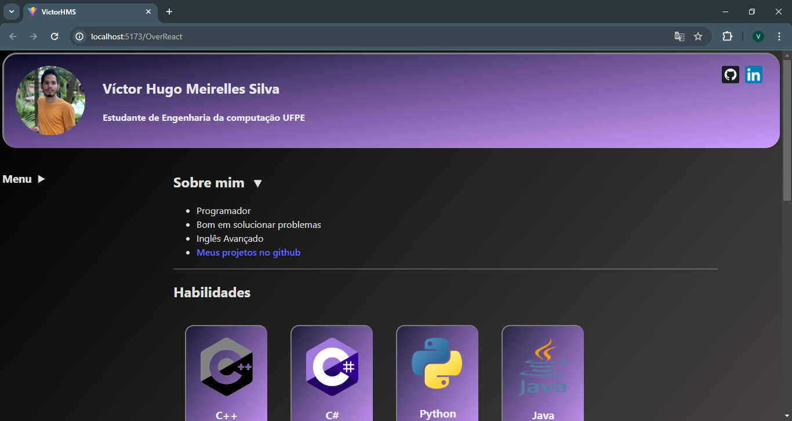

# Over React
- Uma página sobre mim feita em react! 
- [Você pode visualizá-la clicando aqui](https://victorhms.github.io/OverReact/)
  

## Instalar e rodar
- `git clone https://github.com/VictorHMS/OverReact.git`
  > clona o repositório
- `cd over-react`
  > entra na pasta do projeto 
- `npm run dev`
  > Roda o projeto
